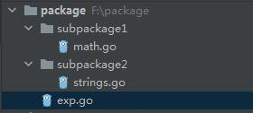

# 包package

## 定义

package本质上就是一个目录，目录里包含有一个或者多个Go源程序文件，或者package。也就是说package里面还可以嵌套包含子package。

每个Go源文件都属于一个package，在源文件开头指定package名称

```go
package package_name
```

package的代码结构示例如下：



package里的变量、函数，结构体，方法等如果要被package外的程序引用，需要在命名的时候首字母大写。

如果首字母小写，那就只能在同一个package里面被使用。**注意**，这里说的是同一个package，不是同一个文件，


package的使用分为3类情况

* 使用Go标准库自带的package
* 使用go get获取到的第三方package
* 使用工程本地的package


## 在Module中使用package


## package嵌套


## 注意事项

* package目录名和package目录下的Go源程序文件开头声明的包名可以不一样，不过一般还是写成一样，避免出错
* 

## References

* https://www.callicoder.com/golang-packages/

* https://www.liwenzhou.com/posts/Go/import_local_package_in_go_module/